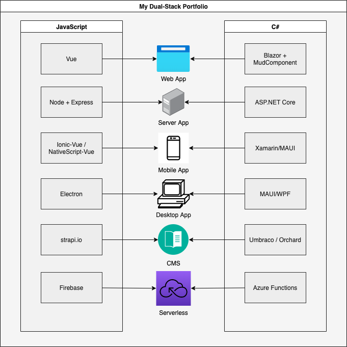

# My Dual-Stack Journey

This repository shows how I struggle between 2 technical stacks (Vue/JS & C#).

Try to implement the same identical and minimal full-stack product that could launch to production for each stack.

The stacks used in this repo are shown in the diagram below:

# Default .gitignore repository template
Using this repo to save time from editing .gitignore to ignore MacOS and JetBrains file on top of Visual Studio setting. Please remove the `LICENSE` file when creating private repositories or change to other [LICENSE](https://choosealicense.com/) file to suit your needs.

## Rules of development:
1. Direct commit to `master`, `dev`, `demo` has disabled.

2. All works should branch from `dev` branch with meaningful branch name with prefix [`fix/`/`feature/`/`enhancement/`/`code-quality/`].

3. All working branch should correspond to an specific issue. If no corresponding issue exists, create one with respective tags as below:

| `fix` | `feature` | `enhancement` | `code-quality` |
| :- | :- | :- | :- |
| Things not working as expected / not working. | New functional requirement to add to project. | Modify current code for non-functional requirement. / Enhance exisiting feature. | Code quality problem discovered manually or by CI/CD tools or by static code analysis tools. |

4. Create **one** branch for **one** issue to do **one** thing at a time. Then create pull-request to merge back to `dev` branch. **(1-1-1 SRP Rule)**

5. Actions for branches when push. (Except push from `dev-ops` and `doc` branches, which cause no action trigger.)

| `master` | `demo` | `dev` | `release/package` | `release/subproject` | `release/YYYYQ#` |
| :- | :- | :- | :- | :- | :- |
| Deploy `latest` container to production environment. | Build container with `demo` tag & deploy to demo environment. | Build, test | Build, publish package | Build subproject container with version and `latest` tag | No action |

6. Branches allowed to pull-request from:

| **Target branch** | `master` | `demo` | `dev` | `release/subproject/#`, `release/package` |
| :- | :- | :- | :- | :- |
| **Source branch** | `release/subproject/#` | `dev`, `release/subproject/#` | `fix/`,`feature/`,`enhancement/`,`code-quality/`,`doc/`,`dev-ops` | `dev`

7. Each `release/` branch should for **one** package/subject version only. (Except `release/YYYYQ#` branches)

8. When `dev` branch collected enough update and tested sufficiently, `release/subproject/#` or `release/package` will create from `dev`.

9. `release/subproject/#` merge to `master` only if `demo` confirmed safe.

10. `release/YYYYQ#` will create quarterly for whole project.

11. Do **NOT** commit any user-secrets, password, unnecessary config files, your own shell script files, large binary files (image, audio, video) into the repo.

12. It will be better to involve only one person in a pull-request if possible for easier tracking code changes with Squash & Merge option.

13. Your pull-requests should have **ALL** warnings and errors fixed as stated in both GitHub tools (e.g. Codefactor) and static code analysis tools in your IDE. (e.g. JetBrains Rider / R# in Visual Studio).

14. Local build scripts (`.bat` on windows `.sh` on *nix based OS) should be excluded from repository commit. By default your local scripts should named in `local-*.[bat|sh]` pattern.

15. Environment variables checker must be implemented in your app no matter its frontend vue or backend dotnet code instead of using magic default numbers/strings.

16. Your code need to work in the following environments in sequence:
- `local development build`
- `local release build`
- `local container environment`
- `public cloud development container environment (your own account)`
- `public cloud staging/demo container environment`
- `public cloud production container environment`

17. Your code configuration should be very easy, strict forward, with minimal to no changes when switching the environments on rule 16. For example, there should be only one file to change the values inside in order to make the code works on each environment.
